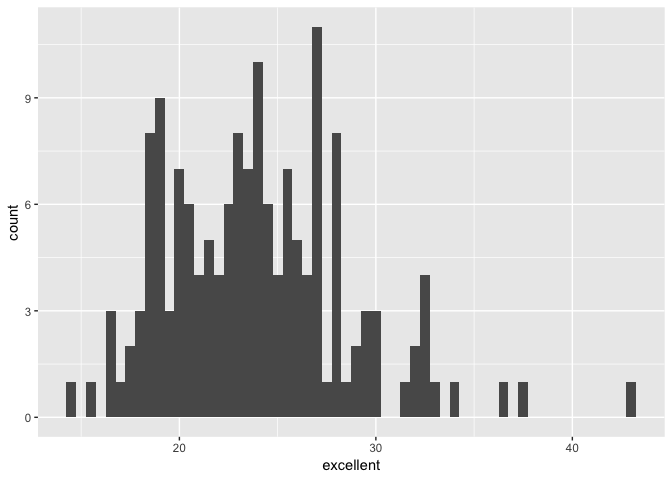
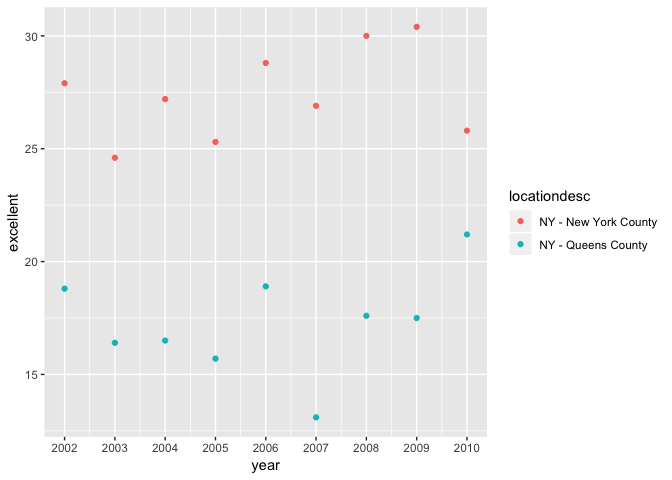

P8105\_hw2\_ykk2116
================
Yaa Asantewaa Klu
10/1/2018

### Problem 1

*Loading tidyverse, accessing data file and reading/cleaning
    dataset*

``` r
library(tidyverse) 
```

    ## ── Attaching packages ────────────────────────────────────────────────────────────────────── tidyverse 1.2.1 ──

    ## ✔ ggplot2 3.0.0     ✔ purrr   0.2.5
    ## ✔ tibble  1.4.2     ✔ dplyr   0.7.6
    ## ✔ tidyr   0.8.1     ✔ stringr 1.3.1
    ## ✔ readr   1.1.1     ✔ forcats 0.3.0

    ## ── Conflicts ───────────────────────────────────────────────────────────────────────── tidyverse_conflicts() ──
    ## ✖ dplyr::filter() masks stats::filter()
    ## ✖ dplyr::lag()    masks stats::lag()

``` r
nyc_subway = read_csv(file =  "./data/NYC_Transit_Subway_Entrance_And_Exit_Data (1).csv") %>%
janitor::clean_names(dat = .) %>%
select(line, station_name, station_latitude, station_longitude, route1:route11, entry, vending, entrance_type, ada) %>%
mutate(entry = recode(entry, "YES" =  TRUE, "NO" = FALSE))
```

    ## Parsed with column specification:
    ## cols(
    ##   .default = col_character(),
    ##   `Station Latitude` = col_double(),
    ##   `Station Longitude` = col_double(),
    ##   Route8 = col_integer(),
    ##   Route9 = col_integer(),
    ##   Route10 = col_integer(),
    ##   Route11 = col_integer(),
    ##   ADA = col_logical(),
    ##   `Free Crossover` = col_logical(),
    ##   `Entrance Latitude` = col_double(),
    ##   `Entrance Longitude` = col_double()
    ## )

    ## See spec(...) for full column specifications.

**The dataset contains information on the subway stations and railway
tracks in New York City. The variables in the dataset include the
different railway lines, the names of the stations, the directions of
the railway lines in terms of longitudes and latitudes, the routes used,
information on vending accessibility and information on their ADA
compliance.**

**Using the code chunk above, the variable names were cleaned by turning
them into lowercase letters, and spaces between the variable names were
replaced with underscores. The code also selects the specific variables
as instructed and the entry variable was also changed from a factor
variable into a logical variable.**

**The dataset has 1868 rows and 19 columns. At this point the dataset is
not entirely tidy because input for route are spread across 11 different
columns and also the route number is part of the variable name of
route.**

*Distinct stations, and stations which are ADA complaint*

``` r
unique_stations = distinct(nyc_subway, line, station_name, ada)

nrow(unique_stations)
```

    ## [1] 465

``` r
sum(unique_stations$ada)
```

    ## [1] 84

**There are 1868 distinct stations and 84 of these distinct stations are
ADA compliant.**

*Stations without vending, but with entrance/exits*

``` r
entry_vending = nyc_subway %>%
mutate(vending = recode(vending, "YES" = TRUE, "NO" = FALSE),
       entry_no_vending = !(vending == entry)) %>%
  filter(!(vending == TRUE & entry == FALSE))

sum(entry_vending$entry_no_vending)/nrow(entry_vending)       
```

    ## [1] 0.03695769

**There proportion of stations with entrance/exits but with no vending
is 0.0369577.**

*Reformatted data so that route number and route name are distinct
variables*

``` r
reformatted_nyc_subway = nyc_subway %>%
  gather(key = route, value = train, route1:route11) %>%
  separate(route, into = c("remove1", "route"), sep = 5) %>%
  select(everything(), -remove1) %>% 
  distinct(line, station_name, train, ada) %>% 
  filter(train == "A")
 
nrow(reformatted_nyc_subway)
```

    ## [1] 60

``` r
sum(reformatted_nyc_subway$ada)
```

    ## [1] 17

**The number of distinct stations that serve the A train is 60 and 17
are ADA compliant.**

### Problem 2

*Loading, reading and cleaning
dataset*

``` r
trash_wheel = readxl::read_excel("./data/HealthyHarborWaterWheelTotals2018-7-28.xlsx", sheet = "Mr. Trash Wheel", range = "A2:N258") %>%
janitor::clean_names(dat = .) %>%
  filter(!is.na(dumpster)) %>%
  mutate(sports_balls = as.integer(sports_balls))
```

*Reading and cleaning 2016 and 2017 precipitation
data*

``` r
precipitation_2016 = readxl::read_excel("./data/HealthyHarborWaterWheelTotals2018-7-28.xlsx", sheet = "2016 Precipitation", range = "A2:B14") %>%
  janitor::clean_names(dat = .) %>%
  mutate(year = 2016) 

precipitation_2017 = readxl::read_excel("./data/HealthyHarborWaterWheelTotals2018-7-28.xlsx", sheet = "2017 Precipitation", range = "A2:B14") %>%  
  janitor::clean_names(dat = .) %>%
  mutate(year = 2017)
```

*Combining the two (2016 and 2017)
datasets*

``` r
precipitation_2016_2017 = bind_rows(precipitation_2016, precipitation_2017)

month_vector =  month.name[c(pull(precipitation_2016_2017, month))]
 
month_df = tibble::as.tibble(month_vector) 

final_precipitation_2016_2017 = bind_cols(precipitation_2016_2017, month_df) %>%
  select(-month) %>%
  select(year, month = value, total)
```

*Median number of sports balls in a dumpster in 2016*

``` r
median_balls_2016 = trash_wheel %>% 
  filter(year == 2016) 
```

**Mr. Trash Wheel dataset has information on a water wheel waste
collector and it comprise of 216 rows x r 14 and this was observed after
data cleaning. The key variables in the dataset include: dates (month,
year, date) of trash collection, weight/volume (weight\_tons,
volume\_cubic\_yards) of trash collected and the types of trash
collected (plastic\_bottles, glass\_bottles, grocery\_bags,
sports\_balls, chip\_bags, etc.).**

**The 2016 and 2017 dataset contains information on precipitation (total
variable) measurements for each month (month variable) in 2016 and 2017.
For the 2016 precipitation dataset, there are 12 rows and 3. For the
2017 precipitation dataset, there are 12 rows and 3 columns.**

**The total precipitation in 2017 was 32.93 and the median number of
sports balls was 26.**

### Problem 3

*Loading
    dataset*

``` r
devtools::install_github("p8105/p8105.datasets")
```

    ## Skipping install of 'p8105.datasets' from a github remote, the SHA1 (21f5ad1c) has not changed since last install.
    ##   Use `force = TRUE` to force installation

``` r
library(p8105.datasets)

data(brfss_smart2010)
```

*Cleaning dataset and data wrangling*

``` r
brfss_data = janitor::clean_names(dat = brfss_smart2010) %>%
  filter(topic == "Overall Health") %>%
  select(-(class:question), -sample_size, -(confidence_limit_low:geo_location)) %>%
  spread(key = response, value = data_value) %>%
  janitor::clean_names(dat = .) %>%   
mutate(excellent_verygood = excellent + very_good)
```

*Questions*

``` r
nrow(distinct(brfss_data, locationabbr))
```

    ## [1] 51

``` r
most_observed_state = count(brfss_data, locationabbr) %>%
  top_n(1, n) 

pull(most_observed_state, locationabbr)   
```

    ## [1] "NJ"

``` r
pull(most_observed_state, n)
```

    ## [1] 146

**There are 404 unique locations and 51 states in the dataset. Yes,
every state is represented in the dataset. It also contains the federal
district of the United States, which is the District of Columbia.**

**The state that is observed the most is NJ and it is most observed,
having 146 counties.**

``` r
bdata_2002 = brfss_data %>% 
  filter(year == 2002)

median(bdata_2002$excellent, na.rm = TRUE) 
```

    ## [1] 23.6

**In 2002, the median value of the “Excellent” response value is 23.6.**

*Plots*

**Histogram**

``` r
ggplot(bdata_2002, aes(x = excellent)) + 
  geom_histogram(binwidth = 0.5)
```

    ## Warning: Removed 2 rows containing non-finite values (stat_bin).

<!-- -->

**Scatterplot**

``` r
brfss_data %>% 
  filter(locationdesc %in% c("NY - New York County", "NY - Queens County"), year %in% c("2002":"2012")) %>% 
  ggplot(aes(x = year, y = excellent, color = locationdesc)) +
  geom_point() +
scale_x_continuous(breaks = c(2002, 2003, 2004, 2005, 2006, 2007, 2008, 2009, 2010))
```

<!-- -->
